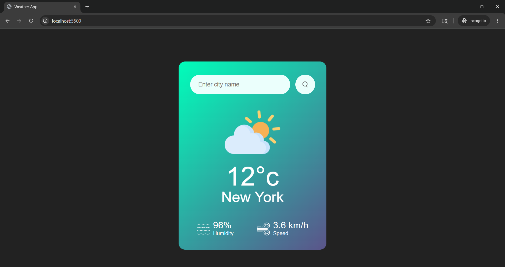

# 🌤️ Weather App

A sleek, real-time weather application that fetches live data using the OpenWeather API.

## 🚀 Features

- **Real-time Data:** Get current temperature, humidity, and wind speed.
- **City Search:** Look up weather conditions for any city worldwide.
- **Dynamic Icons:** Weather icons change based on current conditions (sunny, rainy, etc.).
- **Error = Handling:** Friendly alerts if a city name is misspelled or not found.

## 🛠️ Tech Stack

- **HTML5:** Semantic structure.
- **CSS3:** Responsive layout and modern styling.
- **JavaScript (ES6):** Fetch API and DOM manipulation.
- **OpenWeatherMap API:** Source for global weather data.

## 📸 Screenshot

## 🌐 Live Demo

👉 https://suryabag.github.io/weather-app

## 📂 Project Setup

1. **Clone the repo:** `git clone https://github.com/SuryaBag/weather-app.git`
2. **Get an API Key:** Sign up at OpenWeatherMap to get your free key.
3. **Configure:** Replace the apiKey variable in script.js with your own key.
4. **Launch:** Open index.html in your browser.

## 📌 Author

Surya Bag
